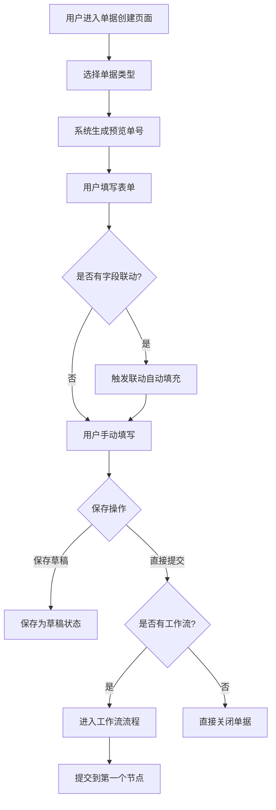
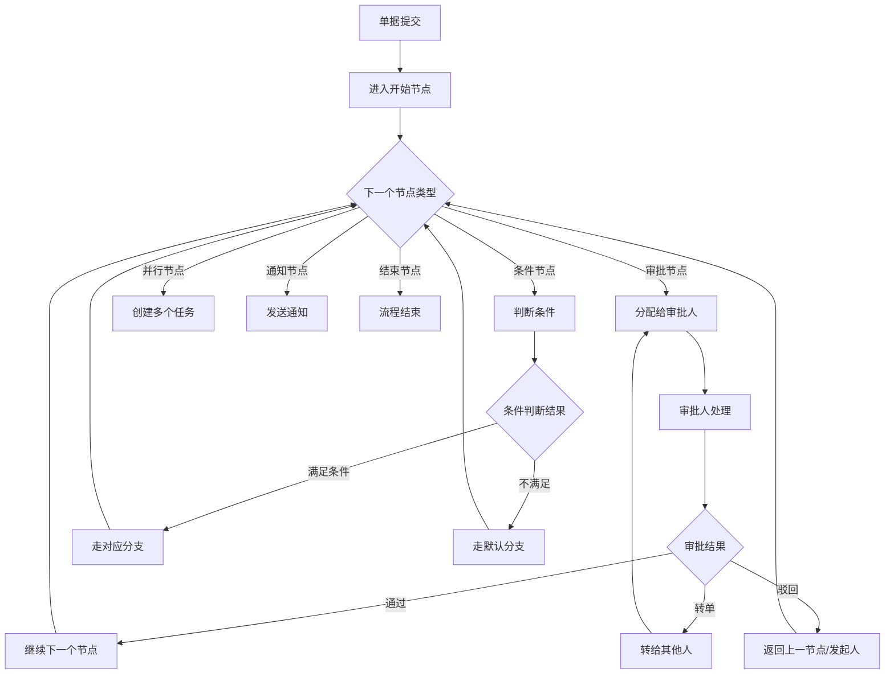
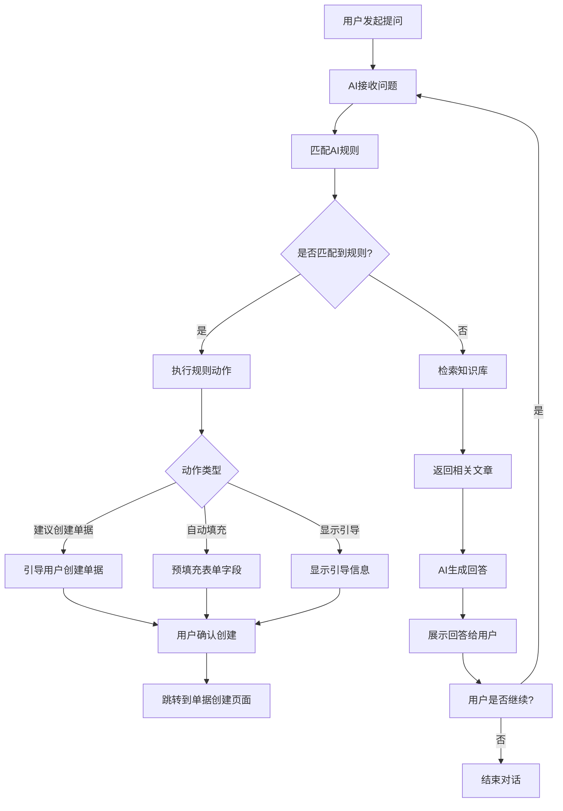

# AI辅助单据管理系统 - 功能设计文档

## 📋 文档信息

- **项目名称**: AI辅助单据管理系统
- **版本**: v0.1.1
- **创建日期**: 2026-04-28
- **文档类型**: 系统功能设计文档
- **适用范围**: 开发团队、产品团队、测试团队

---

## 🎯 1. 系统概述

### 1.1 系统简介

AI辅助单据管理系统是一个智能化的企业级单据管理平台，结合了低代码表单设计、工作流审批引擎和AI智能助手功能。系统旨在帮助企业快速搭建各类单据管理系统，提高业务流程效率，通过AI辅助降低用户使用门槛。

### 1.2 核心价值

- **智能化**: AI助手智能识别用户意图，自动填充表单字段，提供操作指引
- **灵活化**: 低代码表单设计器，支持自定义字段类型和业务规则
- **流程化**: 可视化工作流设计器，支持复杂审批流程配置
- **集成化**: 与企业基础数据深度集成，支持VIN码、经销商等信息联动
- **移动化**: 响应式设计，支持多终端访问

### 1.3 目标用户

- **系统管理员**: 负责系统配置、用户管理、权限分配
- **业务设计师**: 负责设计单据类型、配置工作流程
- **普通用户**: 提交各类业务单据，查看处理进度
- **审批人员**: 处理待审批单据，进行审批决策
- **知识管理员**: 维护AI知识库，优化问答规则

---

## 🏗️ 2. 功能架构

### 2.1 系统功能模块

```
AI辅助单据管理系统
├── 设计中心 (Designer)
│   ├── 单据类型管理
│   ├── 表单设计器
│   ├── 工作流设计器
│   └── 页面配置器
├── 运行中心 (Runtime)
│   ├── 单据创建
│   ├── 单据列表
│   ├── 单据详情
│   └── 审批处理
├── 管理中心 (Admin)
│   ├── 用户管理
│   ├── 角色权限
│   ├── AI规则配置
│   └── 知识库管理
├── 基础数据 (Master Data)
│   ├── 车辆信息库
│   ├── 经销商信息库
│   ├── 配件信息库
│   └── 订单信息库
└── AI助手 (AI Assistant)
    ├── 智能问答
    ├── 表单预填充
    ├── 知识检索
    └── 对话历史
```

### 2.2 技术架构

- **前端框架**: Next.js 16.2.0 (React 19.2.4)
- **UI组件库**: Radix UI + Tailwind CSS
- **状态管理**: Zustand
- **表单处理**: React Hook Form + Zod
- **工作流渲染**: @xyflow/react
- **AI集成**: @ai-sdk/react
- **数据存储**: LocalStorage (客户端存储)
- **类型安全**: TypeScript

---

## 📱 3. 核心功能设计

### 3.1 设计中心

#### 3.1.1 单据类型管理

**功能描述**: 管理系统中的各类单据类型，定义单据基本属性和行为。

**核心功能**:
- 单据类型的增删改查
- 单据编号规则配置
- 单据状态管理（草稿/已发布）
- 字段数量和单据数量统计
- 单据类型复制功能

**数据模型**:
```typescript
interface DocumentType {
  id: string
  name: string           // 单据类型名称
  code: string           // 类型编码
  description?: string   // 描述
  fields: FormField[]    // 表单字段配置
  layout: 'vertical' | 'horizontal' | 'grid'
  numberRule?: DocumentNumberRule  // 编号规则
  workflowEnabled?: boolean
  actionButtons?: ActionButton[]
  enableReply?: boolean
  status: 'draft' | 'published'
  order: number
  createdAt: string
  updatedAt: string
}
```

**用户交互流程**:
1. 点击"新建单据类型"按钮
2. 填写单据类型基本信息（名称、编码、描述）
3. 选择状态（草稿/已发布）
4. 保存后自动跳转到表单设计页面

#### 3.1.2 表单设计器

**功能描述**: 可视化设计单据表单字段，支持多种字段类型和高级配置。

**字段类型支持**:

**基础字段**:
- 单行文本 (text)
- 数字 (number)
- 多行文本 (textarea)
- 日期 (date)
- 日期时间 (datetime)
- 下拉选择 (select)
- 单选 (radio)
- 多选 (checkbox)
- 开关 (switch)

**高级字段**:
- 文件上传 (file)
- 富文本 (richtext)
- 子表格 (subtable)
- 电子签名 (signature)
- 级联选择 (cascade)
- 公式计算 (formula)

**布局字段**:
- 分割线 (divider)
- 说明文字 (description)

**核心功能**:
- 拖拽式字段添加
- 字段属性配置
- 字段宽度设置（全宽/半宽/三分之一宽）
- 字段显示/隐藏控制
- 字段必填设置
- 字段默认值设置
- 字段联动配置

**字段联动机制**:
- VIN码联动: 输入VIN码自动填充车辆信息
- 经销商编码联动: 输入经销商编码自动填充经销商信息
- 配件编号联动: 输入配件编号自动填充配件信息
- 订单号联动: 输入订单号自动填充订单信息

#### 3.1.3 工作流设计器

**功能描述**: 可视化设计审批工作流程，支持多种节点类型和流程控制。

**节点类型**:
- 开始节点 (start)
- 结束节点 (end)
- 创建节点 (create)
- 填写节点 (fill)
- 提交节点 (submit)
- 审批节点 (approve)
- 审核节点 (review)
- 条件节点 (condition)
- 并行节点 (parallel)
- 会签节点 (countersign)
- 通知节点 (notify)
- 转单节点 (transfer)
- 转换节点 (convert)

**核心功能**:
- 拖拽式流程设计
- 节点属性配置
- 审批人设置（用户/角色/部门/发起人/上级）
- 条件分支配置
- 超时处理设置
- 节点权限配置
- 流程事件配置

**数据模型**:
```typescript
interface WorkflowConfig {
  id: string
  name: string
  categoryId: string        // 关联单据类型
  description?: string
  nodes: WorkflowNode[]     // 流程节点
  edges: WorkflowEdge[]     // 流程连线
  events: FlowEvent[]       // 流程事件
  statuses: DocumentStatusConfig[]
  status: 'draft' | 'published'
  createdAt: string
  updatedAt: string
}
```

#### 3.1.4 页面配置器

**功能描述**: 配置单据列表页面和详情页面的显示布局。

**核心功能**:
- 列表列配置
- 筛选条件配置
- 操作按钮配置
- 页面布局设置
- 批量操作配置

### 3.2 运行中心

#### 3.2.1 单据创建

**功能描述**: 用户基于已发布的单据类型创建新的业务单据。

**核心功能**:
- 单据类型选择
- 动态表单渲染
- 字段联动自动填充
- 表单验证
- 草稿保存
- 单据提交

**用户交互流程**:
1. 选择单据类型
2. 系统自动生成预览单号
3. 填写表单字段
4. VIN码/经销商编码自动联动
5. 保存草稿或直接提交
6. 提交后进入工作流（如有配置）

**特殊功能**:
- VIN码识别弹窗: 显示自动识别的车辆信息
- 经销商识别弹窗: 显示自动识别的经销商信息
- 字段联动状态显示: 自动填充的字段显示对勾标识

#### 3.2.2 单据列表

**功能描述**: 展示用户可见的所有单据，支持筛选和搜索。

**核心功能**:
- 单据列表展示
- 状态筛选
- 关键词搜索
- 时间范围筛选
- 批量操作
- 单据导出

#### 3.2.3 单据详情

**功能描述**: 查看单据详细信息，显示审批进度和历史记录。

**核心功能**:
- 表单数据展示
- 审批进度可视化
- 审批历史记录
- 单据状态变更
- 回复/评论功能
- 附件查看

#### 3.2.4 审批处理

**功能描述**: 审批人员处理待审批单据，进行审批决策。

**核心功能**:
- 待审批单据列表
- 单据详情查看
- 审批操作（通过/驳回/转单）
- 审批意见填写
- 批量审批
- 审批历史查看

### 3.3 管理中心

#### 3.3.1 用户管理

**功能描述**: 管理系统用户账号，分配用户角色。

**核心功能**:
- 用户增删改查
- 用户状态管理（正常/禁用）
- 用户角色分配
- 用户信息搜索
- 部门信息管理

**数据模型**:
```typescript
interface User {
  id: string
  username: string       // 用户名
  name: string           // 姓名
  email?: string         // 邮箱
  department?: string    // 部门
  roles: string[]        // 角色ID列表
  status: 'active' | 'inactive'
  createdAt: string
  updatedAt: string
}
```

#### 3.3.2 角色权限

**功能描述**: 定义系统角色和权限，控制用户访问权限。

**核心功能**:
- 角色定义
- 权限配置
- 角色权限分配
- 节点权限配置
- 字段权限配置

**权限类型**:
- 页面访问权限
- 按钮操作权限
- 字段可见权限
- 字段编辑权限
- 数据访问权限

#### 3.3.3 AI规则配置

**功能描述**: 配置AI问答规则，优化AI助手响应逻辑。

**核心功能**:
- 规则定义（匹配条件+触发动作）
- 优先级设置
- 规则启用/禁用
- 规则测试
- 字段映射配置

**数据模型**:
```typescript
interface AIDocumentRule {
  id: string
  name: string
  description?: string
  enabled: boolean
  priority: number
  matchConditions: AIMatchCondition[]
  matchLogic: 'and' | 'or'
  action: AIRuleAction
  createdAt: string
  updatedAt: string
}
```

**匹配条件类型**:
- 关键词匹配 (keyword)
- 意图匹配 (intent)
- 分类匹配 (category)
- 实体匹配 (entity)

**触发动作类型**:
- 建议创建单据 (suggest_document)
- 自动填充字段 (auto_fill)
- 显示引导信息 (show_guide)
- 升级处理 (escalate)

#### 3.3.4 知识库管理

**功能描述**: 维护AI知识库文章，提供智能问答基础数据。

**核心功能**:
- 知识文章创建
- 文章分类管理
- 标签和关键词设置
- 文章发布管理
- 查看统计（浏览量、有帮助数）
- 相关单据类型关联

**数据模型**:
```typescript
interface KnowledgeArticle {
  id: string
  title: string
  category: 'manual' | 'faq' | 'troubleshooting' | 'specification' | 'notice' | 'other'
  content: string                    // Markdown格式
  tags: string[]
  keywords: string[]
  attachments?: string[]
  relatedDocumentTypes?: string[]
  viewCount: number
  helpful: number
  status: 'draft' | 'published' | 'archived'
  createdBy: string
  createdByName: string
  createdAt: string
  updatedAt: string
}
```

### 3.4 基础数据管理

#### 3.4.1 车辆信息库

**功能描述**: 管理车辆基础信息，支持VIN码查询和联动。

**核心功能**:
- 车辆信息维护
- VIN码查询
- 车型信息管理
- 生产信息管理
- 销售信息管理

**数据模型**:
```typescript
interface Vehicle {
  id: string
  vin: string              // VIN码
  platform?: string        // 车型平台
  model?: string           // 车型
  productionDate?: string  // 生产日期
  engineNumber?: string    // 发动机号
  color?: string           // 颜色
  dealerCode?: string      // 经销商编码
  saleDate?: string        // 销售日期
  status: 'active' | 'inactive'
  createdAt: string
  updatedAt: string
}
```

#### 3.4.2 经销商信息库

**功能描述**: 管理经销商基础信息，支持经销商编码查询和联动。

**核心功能**:
- 经销商信息维护
- 经销商编码查询
- 联系信息管理
- 地址信息管理

#### 3.4.3 配件信息库

**功能描述**: 管理配件基础信息，支持配件编号查询和联动。

**核心功能**:
- 配件信息维护
- 配件编号查询
- 配件分类管理
- 供应商信息管理
- 价格信息管理

**数据模型**:
```typescript
interface Part {
  id: string
  partNumber: string       // 配件编号
  partName: string         // 配件名称
  category?: string        // 配件分类
  specification?: string   // 规格型号
  unit?: string            // 单位
  price?: number           // 单价
  supplier?: string        // 供应商
  applicableModels?: string[]  // 适用车型
  status: 'active' | 'inactive'
  createdAt: string
  updatedAt: string
}
```

#### 3.4.4 订单信息库

**功能描述**: 管理订单基础信息，支持订单号查询和联动。

**核心功能**:
- 订单信息维护
- 订单号查询
- 发货信息管理
- 订单明细管理
- 订单状态跟踪

### 3.5 AI助手

#### 3.5.1 智能问答

**功能描述**: 基于知识库的智能问答系统，为用户提供即时帮助。

**核心功能**:
- 自然语言问答
- 知识库检索
- 多轮对话支持
- 引用资料展示
- 对话历史管理

**技术实现**:
- AI SDK集成
- 知识库向量化
- 语义匹配算法
- 规则引擎

#### 3.5.2 表单预填充

**功能描述**: AI根据用户描述自动提取信息并填充表单字段。

**核心功能**:
- 智能信息提取
- VIN码识别
- 故障码识别
- 字段自动映射

**数据模型**:
```typescript
interface AIFieldMapping {
  sourceKey: string       // 从对话中提取的信息标识
  targetField: string     // 目标单据字段名
  extractPattern?: string // 提取模式（正则表达式）
}
```

#### 3.5.3 知识检索

**功能描述**: 基于用户问题检索相关知识库文章。

**核心功能**:
- 关键词检索
- 语义检索
- 分类筛选
- 相关度排序
- 文章推荐

#### 3.5.4 对话历史

**功能描述**: 保存用户的对话历史，支持会话恢复和查看。

**核心功能**:
- 对话记录保存
- 会话状态管理
- 历史记录查看
- 问题解决状态跟踪

**数据模型**:
```typescript
interface AIConversation {
  id: string
  userId: string
  userName: string
  messages: AIMessage[]
  resolved: boolean
  createdDocumentId?: string
  createdAt: string
  updatedAt: string
}
```

---

## 📊 4. 数据模型设计

### 4.1 核心实体关系

```
用户 (User) ───┐
               ├──> 角色 (Role) ───> 权限 (Permission)
               └──> 单据 (Document) ───> 单据类型 (DocumentType)
                      │                    │
                      ├──> 工作流 (Workflow) ─┘
                      ├──> 审批记录 (ApprovalRecord)
                      └──> 单据回复 (DocumentReply)
```

### 4.2 数据存储架构

- **存储方式**: LocalStorage (客户端)
- **数据结构**: JSON格式
- **存储键命名规范**: `lowcode_{entity_name}`

**主要存储表**:
- `lowcode_users`: 用户数据
- `lowcode_roles`: 角色数据
- `lowcode_document_types`: 单据类型
- `lowcode_documents`: 单据数据
- `lowcode_workflows`: 工作流配置
- `lowcode_approvals`: 审批记录
- `lowcode_knowledge_articles`: 知识库文章
- `lowcode_ai_conversations`: AI对话记录
- `lowcode_parts`: 配件信息
- `lowcode_orders`: 订单信息
- `lowcode_vehicles`: 车辆信息

---

## 🔄 5. 业务流程设计

### 5.1 单据创建流程



### 5.2 工作流审批流程



### 5.3 AI问答流程



---

## 🎨 6. 界面设计规范

### 6.1 设计原则

- **简洁性**: 界面简洁明了，避免冗余信息
- **一致性**: 保持整个系统的视觉和交互一致性
- **响应式**: 支持不同屏幕尺寸的设备访问
- **可访问性**: 遵循WCAG无障碍访问标准

### 6.2 色彩规范

- **主色调**: 蓝色系（专业、信任）
- **成功色**: 绿色系
- **警告色**: 橙色系
- **错误色**: 红色系
- **中性色**: 灰色系

### 6.3 组件库

基于Radix UI组件库，包含：
- Button（按钮）
- Input（输入框）
- Select（下拉选择）
- Dialog（对话框）
- Table（表格）
- Form（表单）
- Card（卡片）
- Badge（徽章）
- Toast（提示）
等等

---

## 🔧 7. 技术实现要点

### 7.1 前端架构

- **框架**: Next.js 16.2.0
- **路由**: App Router
- **状态管理**: Zustand
- **表单处理**: React Hook Form + Zod验证
- **UI组件**: Radix UI + Tailwind CSS
- **工作流渲染**: @xyflow/react

### 7.2 数据管理

- **存储方式**: LocalStorage
- **数据结构**: JSON
- **状态同步**: Zustand store
- **数据验证**: Zod schema

### 7.3 AI集成

- **AI SDK**: @ai-sdk/react
- **模型**: 支持多种AI模型（通义千问等）
- **对话管理**: 上下文保持、历史记录
- **规则引擎**: 自研规则匹配引擎

### 7.4 性能优化

- **代码分割**: 动态导入
- **懒加载**: 组件级懒加载
- **缓存策略**: 本地缓存+会话缓存
- **渲染优化**: React.memo、useMemo

---

## 🚀 8. 部署和运维

### 8.1 部署方式

- **开发环境**: `npm run dev`
- **生产构建**: `npm run build`
- **生产启动**: `npm start`

### 8.2 环境要求

- **Node.js**: v18+
- **浏览器**: 现代浏览器（Chrome、Firefox、Safari、Edge）
- **网络**: 需要AI API网络连接

### 8.3 配置管理

- **环境变量**: `.env.local`
- **AI配置**: AI模型API密钥等
- **系统配置**: next.config.mjs

---

## 📈 9. 未来规划

### 9.1 功能增强

- [ ] 实时数据同步
- [ ] 多租户支持
- [ ] 数据分析报表
- [ ] 移动端原生应用
- [ ] 第三方系统集成

### 9.2 性能优化

- [ ] 服务端渲染优化
- [ ] 数据缓存策略
- [ ] 大数据量处理
- [ ] CDN加速

### 9.3 用户体验

- [ ] 暗黑模式支持
- [ ] 国际化支持
- [ ] 无障碍访问优化
- [ ] 快捷键支持

---

## 📞 10. 联系和支持

### 10.1 技术支持

- **项目维护**: 项目团队
- **问题反馈**: GitHub Issues
- **文档更新**: 随功能迭代同步更新

### 10.2 开发指南

- **代码规范**: TypeScript + ESLint
- **提交规范**: Conventional Commits
- **分支策略**: Git Flow
- **测试策略**: 单元测试 + 集成测试

---

**文档版本**: v1.0  
**最后更新**: 2026-04-28  
**维护者**: 项目团队